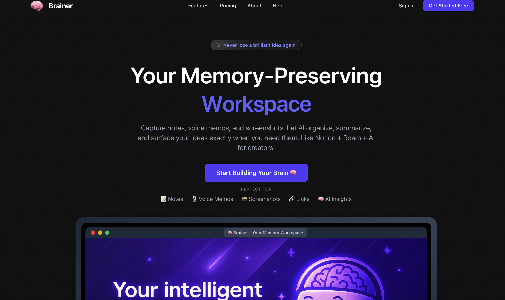
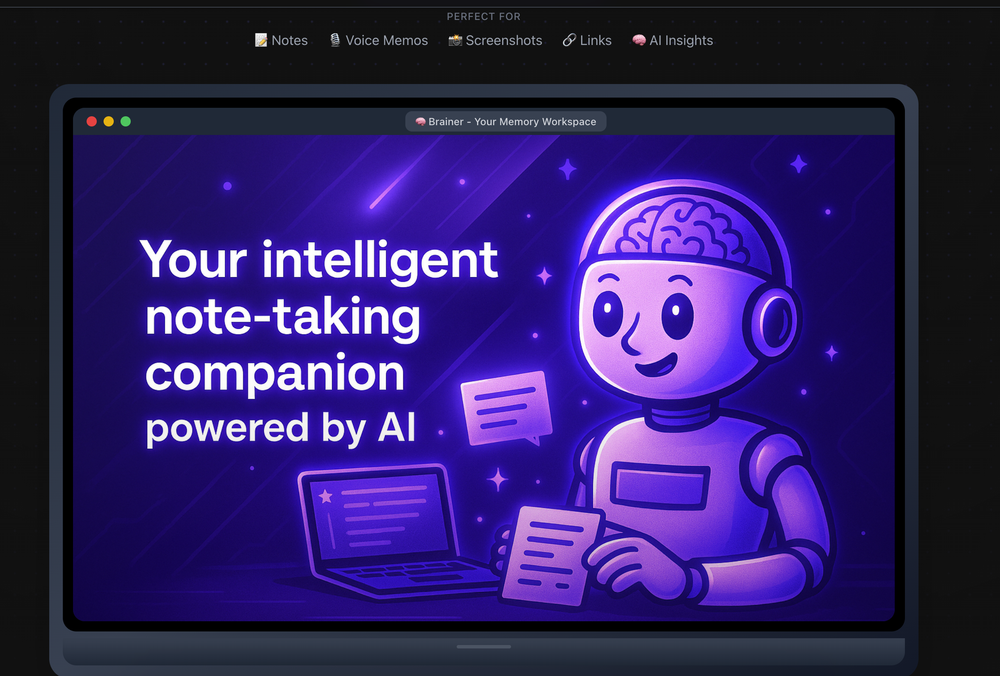

# 🧠 Brainer - Memory-Preserving Workspace

> A powerful note-taking and knowledge management platform that combines the best of Notion, Roam Research, and AI capabilities.



## 🌟 What is Brainer?

Brainer is an intelligent workspace designed to capture, process, and organize your thoughts effortlessly. Whether you're taking voice notes, capturing screenshots, or writing traditional text notes, Brainer transforms all your inputs into searchable, organized knowledge.

## ✨ Key Features

### 🎙️ **Voice-to-Text Transcription**
- Upload audio files (MP3, WAV, M4A, etc.)
- Real-time transcription using AWS Transcribe
- Automatic confidence scoring
- Live progress updates without page refresh

### 📸 **Screenshot OCR**
- Upload images (PNG, JPG, JPEG)
- Extract text from screenshots using OCR
- Support for various image formats
- Instant text extraction and processing

### 📝 **Smart Note Management**
- Create, edit, and delete notes seamlessly
- Markdown support for rich formatting
- Real-time auto-save functionality
- Intuitive note organization

### 🏷️ **Advanced Tagging System**
- Color-coded tags for easy categorization
- Filter notes by multiple tags
- Visual tag management
- Bulk tag operations

### 🔍 **Powerful Search**
- Full-text search across all notes
- Search through transcribed audio content
- OCR text search capabilities
- Instant results as you type

### 🔐 **Secure Authentication**
- Firebase Authentication integration
- User isolation and data privacy
- Secure user sessions
- Multi-provider auth support



## 🛠️ Tech Stack

### **Frontend**
- **Next.js 15** - React framework with App Router
- **TypeScript** - Type-safe development
- **Tailwind CSS** - Utility-first styling
- **Lucide React** - Beautiful icons

### **Backend & Database**
- **Prisma ORM** - Type-safe database client
- **SQLite** - Lightweight database for development
- **Next.js API Routes** - Serverless backend functions

### **Authentication**
- **Firebase Auth** - Secure user authentication
- **Custom user sync** - Database integration

### **AI & Cloud Services**
- **AWS Transcribe** - Professional voice-to-text
- **AWS S3** - Reliable file storage
- **Vision APIs** - OCR text extraction

### **Development Tools**
- **ESLint** - Code linting
- **Prettier** - Code formatting
- **TypeScript** - Static type checking

## 🚀 Getting Started

### Prerequisites
- Node.js 18+ 
- npm or yarn
- AWS Account (for transcription features)
- Firebase project (for authentication)

### Installation

1. **Clone the repository**
   ```bash
   git clone https://github.com/yourusername/brainer.git
   cd brainer
   ```

2. **Install dependencies**
   ```bash
   npm install
   ```

3. **Set up environment variables**
   ```bash
   cp .env.example .env.local
   ```
   
   Fill in your environment variables:
   ```env
   # Firebase Configuration
   NEXT_PUBLIC_FIREBASE_API_KEY=your_firebase_api_key
   NEXT_PUBLIC_FIREBASE_AUTH_DOMAIN=your_project.firebaseapp.com
   NEXT_PUBLIC_FIREBASE_PROJECT_ID=your_project_id
   
   # AWS Configuration
   AWS_ACCESS_KEY_ID=your_aws_access_key
   AWS_SECRET_ACCESS_KEY=your_aws_secret_key
   AWS_REGION=us-east-1
   AWS_S3_BUCKET_NAME=your_s3_bucket_name
   
   # Database
   DATABASE_URL="file:./dev.db"
   ```

4. **Set up the database**
   ```bash
   npx prisma generate
   npx prisma db push
   ```

5. **Run the development server**
   ```bash
   npm run dev
   ```

6. **Open your browser**
   Navigate to [http://localhost:3000](http://localhost:3000)

## 📁 Project Structure

```
brainer/
├── src/
│   ├── app/                 # Next.js App Router
│   │   ├── api/            # API routes
│   │   ├── auth/           # Authentication pages
│   │   └── dashboard/      # Main dashboard
│   ├── components/         # Reusable components
│   ├── hooks/              # Custom React hooks
│   └── lib/                # Utility libraries
├── prisma/                 # Database schema and migrations
├── public/                 # Static assets
└── AWS_SETUP.md           # AWS configuration guide
```

## 🎯 Current Status

### ✅ **Fully Functional**
- ✅ User authentication and registration
- ✅ Note creation, editing, and deletion
- ✅ Voice file upload and transcription
- ✅ Screenshot upload and OCR
- ✅ Real-time transcription updates
- ✅ Tag management and filtering
- ✅ Search functionality
- ✅ Responsive design
- ✅ Error handling and validation

### 🔄 **In Progress**
- 🔄 Performance optimizations
- 🔄 Enhanced UI/UX improvements
- 🔄 Better mobile responsiveness

## 🗺️ Future Roadmap

### 🎯 **Phase 1: AI Integration** (Q1 2025)
- [ ] **AI Summarization** - Automatic note summaries using OpenAI GPT
- [ ] **Smart Suggestions** - AI-powered content recommendations
- [ ] **Semantic Search** - Vector-based search for better relevance
- [ ] **Auto-tagging** - Intelligent tag suggestions

### 🎯 **Phase 2: Enhanced Features** (Q2 2025)
- [ ] **Collaboration** - Real-time collaborative editing
- [ ] **Version History** - Track note changes over time
- [ ] **Advanced Formatting** - Rich text editor with more formatting options
- [ ] **File Attachments** - Support for PDF, Word documents, etc.

### 🎯 **Phase 3: Advanced Capabilities** (Q3 2025)
- [ ] **Knowledge Graphs** - Visual relationship mapping between notes
- [ ] **Advanced Analytics** - Usage insights and productivity metrics
- [ ] **API Integration** - Connect with external tools and services
- [ ] **Mobile Apps** - Native iOS and Android applications

### 🎯 **Phase 4: Enterprise Features** (Q4 2025)
- [ ] **Team Workspaces** - Multi-user collaboration spaces
- [ ] **Admin Dashboard** - User and content management
- [ ] **Advanced Security** - SSO, audit logs, compliance features
- [ ] **Custom Integrations** - Webhook support and custom API endpoints

## 🤝 Contributing

We welcome contributions! Please see our [Contributing Guide](CONTRIBUTING.md) for details.

### Development Workflow
1. Fork the repository
2. Create a feature branch (`git checkout -b feature/amazing-feature`)
3. Commit your changes (`git commit -m 'Add amazing feature'`)
4. Push to the branch (`git push origin feature/amazing-feature`)
5. Open a Pull Request

## 📝 License

This project is licensed under the MIT License - see the [LICENSE](LICENSE) file for details.

## 🙏 Acknowledgments

- **AWS Transcribe** for excellent voice-to-text capabilities
- **Firebase** for robust authentication services
- **Prisma** for the amazing database toolkit
- **Next.js** team for the incredible React framework
- **Tailwind CSS** for the utility-first styling approach

## 📞 Support & Contact

- **Issues**: [GitHub Issues](https://github.com/yourusername/brainer/issues)
- **Discussions**: [GitHub Discussions](https://github.com/yourusername/brainer/discussions)
- **Email**: support@brainer.app

---

<div align="center">
  <strong>Built with ❤️ for knowledge workers everywhere</strong>
</div>
